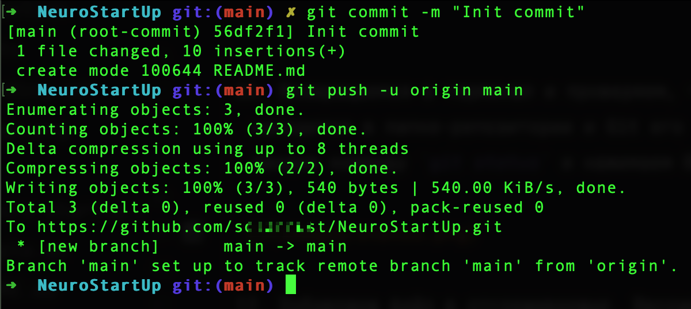
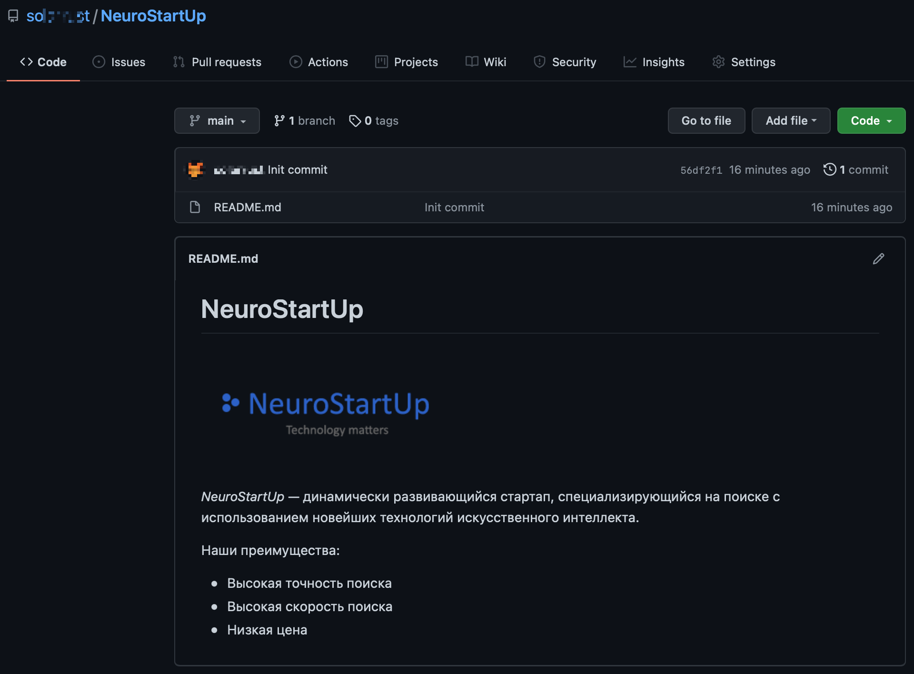

# Решение задачи №1 «Демонстрация» к занятию «Основы Git»

## Ценность выполнения задачи:
Git — универсальный инструмент, который используют в своей работе многие профессии: IT-разработчики, DevOps-инженеры, cистемные администраторы, тестировщики, дизайнеры и системные аналитики.  В результате выполнения этого домашнего задания вы научитесь создавать репозиторий, а также добавлять в него файлы. Это позволит вам отработать навык публикации своих работ на GitHub. В будущем вы будете добавлять в данную систему контроля версий своё портфолио и демонстрировать его работодателю. Это очень полезный и востребованный навык. Успехов в выполнении задания. 

## Текст задачи:

1. Создайте репозиторий на GitHub, склонируйте его на локальную машину. Перейдите в папку, появившуюся после клонирования командой `cd имя-папки`. 
**Переходить в папку репозитория нужно после каждого клонирования.**
1. При помощи текстового редактора в папке репозитория на локальном компьютере создайте файл `README.md` и добавьте в него описание в формате Markdown. 
_Можете скопировать разметку из подсказки и вставить её в файл `README.md`._
У файла `README.md` не должно быть никаких других расширений. Например, имя файла `README.md.txt` будет считаться ошибкой.
1. Сохраните файл. При помощи команды `git status` проверьте, видит ли Git новый файл с названием `README.md`.
1. Сделайте коммит изменений; 
1. Запушьте все изменения на GitHub;
1. Убедитесь, что через веб-интерфейс GitHub можно посмотреть список файлов, список коммитов, изменения, сделанные каждым коммитом.

**В качестве результата пришлите:** 
1. Ссылку на ваш репозиторий на GitHub;
1. Ссылку на последний коммит. Для этого на сайте GitHub нажмите на количество коммитов (под кнопкой <kbd>Code</kbd>), нажмите на последний коммит и скопируйте адрес из адресной строки.


<details>
 <summary>Подсказка: Markdown-разметка для файла README.md</summary>

```markdown
# NeuroStartUp


*NeuroStartUp* — динамически развивающийся стартап, специализирующийся на поиске с использованием новейших технологий искусственного интеллекта.

Наши преимущества:
* Высокая точность поиска
* Высокая скорость поиска
* Низкая цена
```
</details>

    
**ВАЖНО:** 
Данное задание предполагает самопроверку. Это означает, что после публикации решения, вы получите эталонный ответ с пошаговой инструкцией к выполнению задания. Это позволит вам самостоятельно оценить качество выполнения домашнего задания и в случае необходимости внести корректировки, опираясь на шаблон.  
    
## Решение

Перед решением этой задачи вам нужно [зарегистрироваться на сайте GitHub](https://github.com/netology-code/guides/tree/master/github) и [установить Git](https://github.com/netology-code/guides/tree/master/git) на ваш компьютер.

1. Открываем сайт [github.com](https://github.com). 
2. Нажмите на + в правом верхнем углу рядом с вашей аватаркой и выберите пункт «New repository»:


3. В поле «Repository name» введите название нового репозитория. Например, «NeuroStartUp».
4. Убедитесь, что стоит галочка напротив пункта «Public» чтобы ваш репозиторий был доступен для просмотра другим людям.
5. Нажмите кнопку «Create repository».
6. На появившейся странице скопируйте ссылку на только что созданный репозиторий:


7. Откройте командную строку (терминал) в той папке, в которой вы будете хранить домашнее задание на вашем компьютере.
8. Наберите в командной строке команду

```
git clone ссылка-на-репозиторий
```

и нажмите Enter:


9. После клонирования на вашем компьютере появилась новая папка с названием «NeuroStartUp». Чтобы продолжить работу нужно в неё перейти. Наберите команду `cd NeuroStartUp/` и нажмите Enter.
10. Создадим файл с описанием нашего проекта. 

---

**Если у вас Windows:** 
    
1. Откройте Блокнот, вставьте в него текст примера 
2. В меню программы выберите Файл → Сохранить как…. Выберите папку NeuroStartUp и в качестве имени файла введите «README.md». В поле «Тип файла» нажмите на стрелочку и выберите «Все файлы (*.*)».

---

**Если у вас macOS:**

1. К сожалению, в macOS нет встроенных программ, которые умеют работать с Markdown. Нужно будет скачать один из подходящих редакторов:
- Если вам не потребуется работать с кодом дальше в профессии очень простой [TextMate](https://macromates.com)
- Если планируете работать с кодом, то редактор кода [VS Code](https://code.visualstudio.com)
2. Создайте новый файл в выбранном редакторе. Вставьте в него текст примера.
3. В меню программы выберите Файл → Сохранить… или File → Save… Выберите папку NeuroStartUp, и в качестве имени файла введите «README.md».

---

11. Возвращаемся в терминал и проверяем, что файл ридми находится в папке-репозитории и Git его видит. Для этого вводим команду `git status` и нажимаем Enter.


12. Добавляем файл в отслеживаемые. Вводим команду `git add README.md` и нажимаем Enter. Для надёжности можем ещё раз проверить статус файла. Он должен стать зелёным:


13. Файл готов к коммиту! Вводим команду `git commit -m "Init commit"`. Флаг `-m` позволит нам сразу подписать коммит, без открытия текстового редактора. В кавычках пишем подпись коммита.
14. Теперь можно отправлять файл в удалённый репозиторий на GitHub. Вводим команду `git push -u origin main`. `origin` указывает в какой репозиторий мы отправляем файл, а `main` указывает в какую ветку отправляем изменения.



_При отправке файла в удалённый репозиторий могут быть запрошены авторизационные данные. Вводите логин и личный токен. Обратите внимание, что важно вводить логин с большими и маленькими буквами. При вставке токена в командной строке ничего не будет видно. Это нормально и сделано в целях безопасности._

15. Открываем браузер с сайтом GitHub и созданным в самом начале репозиторием. Перезагружаем страницу. Если всё сделано верно, то вы сразу увидите README.md в списке файлов и ниже текст этого файла:



[Репозиторий-образец](https://github.com/netology-code/NeuroStartUp)

Удачи в дальнейшем обучении 👍
